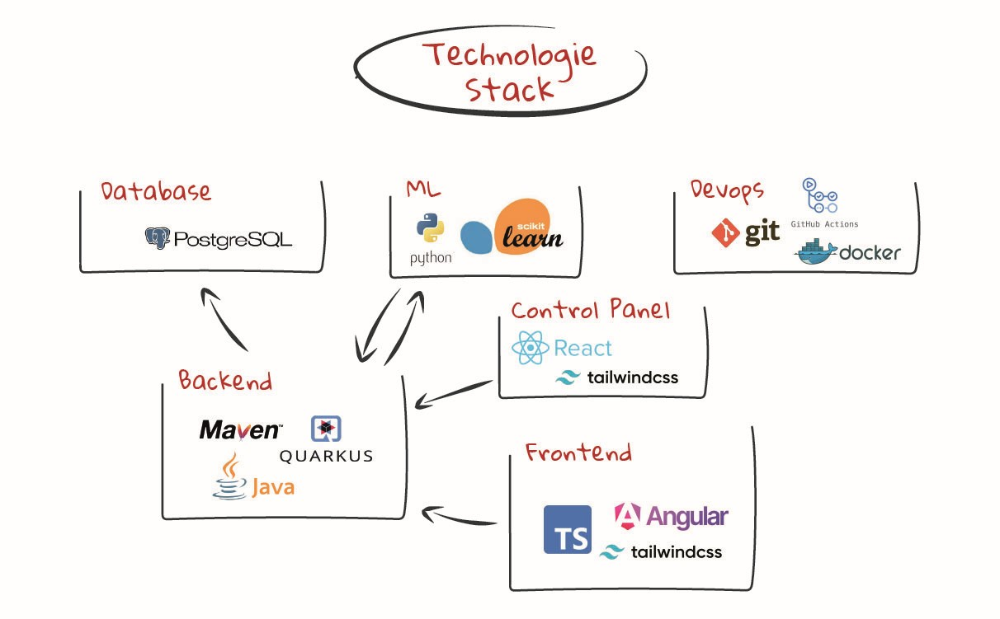

= Danceable

*Developers:* Zinhobel, Hussein, Mayer, Öllinger, Huch

== Overview

Danceable is an innovative application designed to help you find the perfect dance style for any song playing in the background. By analyzing the music, the app provides a *danceability score* and suggests dance styles that best match the rhythm and tempo. Whether you're a beginner or a seasoned dancer, Danceable enhances your dancing experience and helps you connect with the music like never before.

== Microservice Architecture

plantuml:documentation/microservice_architecture.puml[]

== Technologies

- *Backend:* Quarkus (Java)
- *Web Application:* Webpack (Typescript) + TailwindCSS
- *Database:* PostgreSQL (Docker)

=== Upcoming Technologies

- *iOS Application:* Swift (SwiftUI)
- *Android Application:* Kotlin (Jetpack Compose)

== Key Features

=== Music Recording & Uploading
Easily record music through your mobile device or upload a song via the web app for instant analysis.

=== Dance Type Suggestions
Get tailored dance style suggestions that align with the rhythm and tempo of the song.

=== Danceability Score
Danceable generates a detailed score indicating how danceable the song is, using advanced music analysis metrics.

== Target Audience

Danceable is designed for dancers of all skill levels:
- *Beginners* looking to discover suitable dance styles.
- *Intermediate dancers* aiming to explore new rhythms.
- *Professionals* seeking precise dance-style suggestions for various genres.

== Platform Availability

Danceable is currently available exclusively as a *web application*.
We are actively working on expanding accessibility. A *mobile app* for apple as well as android applications is planned.

Thank you for supporting *Danceable* - bringing rhythm to your steps and joy to your dancing journey!

== Getting Started

=== Requirements
Ensure you have the following installed:

- link:https://www.docker.com/products/docker-desktop/[Docker]
- link:https://www.java.com/de/download/manual.jsp[Java] + link:https://maven.apache.org/download.cgi[Maven]
- link:https://nodejs.org/en/download/package-manager[Node.js] + link:https://docs.npmjs.com/downloading-and-installing-node-js-and-npm[npm]

== Setup

Clone the repository:
[source]
----
git clone https://github.com/2425-4bhitm-itp/danceable.git
cd danceable
----

=== Development

Start services in separate terminals:

**Terminal 1:**

[source]
----
cd db
./start.sh
----

**Terminal 2:**

[source]
----
cd backend
mvn quarkus:dev
----

**Terminal 3:**

[source]
----
cd frontend
npm run dev
----

=== Production
Build, package into Images and run Containers.

[source]
----
cd docker
./start.sh
----

== Access the App

Open link:http://localhost:4200[http://localhost:4200] in your browser.

=== Fourier Analysis
View link:http://localhost:4200/analysis[http://localhost:4200/analysis] in your browser to Fourier analyze `.wav` files.