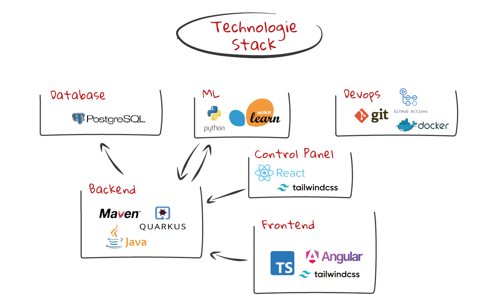

# **Danceable Project**

**Project Name:** Danceable  
**Developers:** Zinhobel, Hussein, Mayer, Öllinger, Huch  

---

## **Overview**

Danceable is an innovative application designed to help you find the perfect dance style for any song playing in the background. By analyzing the music, the app provides a **danceability score** and suggests dance styles that best match the rhythm and tempo. Whether you're a beginner or a seasoned dancer, Danceable enhances your dancing experience and helps you connect with the music like never before.

---

## **Technologies**



- **Backend:** Quarkus (Java)
- **Web Application:** Webpack (Typescript) + TailwindCSS
- **Database:** PostgreSQL (Docker)

## **Upcoming Technologies**

- **Mobile Application:** Swift
---

## **Key Features**

### **1. Music Recording & Uploading**
Easily record music through your mobile device or upload a song via the web app for instant analysis.  

### **2. Dance Type Suggestions**
Get tailored dance style suggestions that align with the rhythm and tempo of the song.  

### **3. Danceability Score**
Danceable generates a detailed score indicating how danceable the song is, using advanced music analysis metrics.  

---

## **Target Audience**

Danceable is designed for dancers of all skill levels:  
- **Beginners** looking to discover suitable dance styles.  
- **Intermediate dancers** aiming to explore new rhythms.  
- **Professionals** seeking precise dance-style suggestions for various genres.  

---

## **Platform Availability**

Danceable is currently available exclusively as a **web application**.  
We are actively working on expanding accessibility. A **mobile app for Apple devices** (Swift-based) is planned.  
Our long-term goal is to make Danceable available on **all devices and platforms**, ensuring a seamless experience for everyone.  

---

Thank you for supporting **Danceable**—bringing rhythm to your steps and joy to your dancing journey!  

# Getting Started

## Requirements
Ensure you have the following installed:

- **[Docker](https://www.docker.com/products/docker-desktop/)**
- **[Java](https://www.java.com/de/download/manual.jsp)** + **[Maven](https://maven.apache.org/download.cgi)**
- **[Node.js](https://nodejs.org/en/download/package-manager)** + **[npm](https://docs.npmjs.com/downloading-and-installing-node-js-and-npm)**

---

## Setup

1. Clone the repository:
   ```bash
   git clone https://github.com/2425-4bhitm-itp/danceable.git
   cd danceable
   ```

2. Start services in separate terminals:

  - **Terminal 1**:
    ```bash
    cd db
    ./start.sh
    ```
  - **Terminal 2**:
    ```bash
    cd backend
    mvn quarkus:dev
    ```
  - **Terminal 3**:
    ```bash
    cd frontend
    npm run dev
    ```
---

## Access the App
Open [http://localhost:4200](http://localhost:4200) in your browser.

### Fourier Analysis
For fourier analyzing .wav files access [http://localhost:4200/analysis.html](http://localhost:4200/analysis.html)